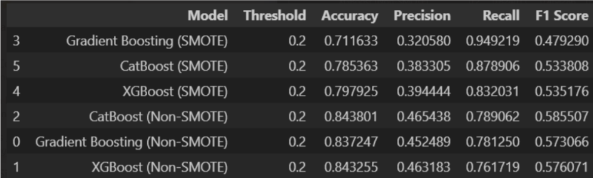

# Solarpanel-Lead-Prediction
Predicting lead success probability for solar panel installations using Gradient Boosting. Optimized CRM resource allocation with 83.2% recall &amp; 74% precision. Includes data preprocessing, feature engineering, SMOTE balancing, and model development.

## **Project Overview**
This project aims to optimize resource allocation for lead management by predicting the **probability of a lead reaching the Site Survey stage**. The model was trained to maximize recall, ensuring that potential leads were not overlooked. The final **Gradient Boosting model achieved 83.2% recall and 74% precision** and was deployed on the **CRM portal**.

## **Dataset**

The dataset consists of customer leads with their attributes, lead generation sources, and timestamps for different stages in the sales pipeline. The final target variable is a **binary classification**:
- **1 (Success)**: The lead reaches the **Site Survey stage**.
- **0 (Not Successful)**: The lead either **goes cold or is lost** at any phase before the site survey.

## **Workflow**
The workflow for data preprocessing, feature engineering, and modeling follows a structured approach:

### **1. Data Preprocessing**
- **Handling Missing Data**:
  - Dropped completely null columns.
  - Standardized missing values (`"-"` replaced with `NA`).
  - Removed entries with null values in critical columns.

- **Standardization & Cleaning**:
  - Renamed inconsistent labels (e.g., `"Installation partner Allocation"` → `"Installation Partner Allocation"`).
  - Consolidated lead sources under unified categories (e.g., variations of website leads grouped as **"inhouse website"**).
  - Standardized city names and assigned **city tiers** (Tier 1, Tier 2, etc.).

- **Timestamp Formatting**:
  - Converted all **date-related columns** to `datetime` format.
  - Extracted **creation and deadline timestamps** for different phases.

---

### **2. Feature Engineering**
- **Phase Categorization**:
  - Defined phases into three broad categories:
    - **Success Phases**: Leads reaching the **Site Survey stage**.
    - **Loss Phases**: Leads marked as **"Order Lost"**, **"Cold Lead"**, or **"Design Infeasible"**.
    - **In-Process Phases**: Leads in **intermediate steps** of the pipeline.

- **Preceding Phase Calculation**:
  - Determined the **last successful phase before a lead was lost**.
  - Used this information to analyze patterns in lead drop-off.

- **Target Variable Creation**:
  - Categorized leads as:
    - **"Success"** → Leads that reached **Site Survey**.
    - **"Cold"** → Leads that went inactive before reaching site survey.
    - **"Dead"** → Leads that were lost due to order cancellations or infeasibility.
    - **"In-Process"** → Leads still progressing.

  - Final target mapping:
    - **Success → 1**
    - **Cold, Dead, In-Process → 0**

- **Additional Features**:
  - **Lead to Communication Time**: Days taken from **lead generation to first communication**.
  - **City Tier Assignment**: Categorized cities into **Tier 1, 2, and 3**.
  - **Lead Source Mapping**: Standardized different lead generation sources into **12 broad categories**.

---

### **3. Data Transformation**
- **One-Hot Encoding**: Converted categorical variables like `Source`, `Cluster`, and `Lead Category` into numerical format.
- **Handling Null Values**: Filled missing values in `Source`, `Form Name`, and `City Tier` using mode imputation.
- **Dropped Unnecessary Data**: Removed irrelevant phases post-survey to keep the dataset focused on pre-site-survey decisions.

---

### **4. Model Training**
- **Train-Test Split**:
  - Split dataset into **80% training and 20% testing**.
  - Further split **10% of training data** for validation.

- **Class Imbalance Handling**:
  - Used **SMOTE (Synthetic Minority Over-sampling Technique)** to generate synthetic samples of minority class.

After comparing a variety of models, Gradient Boosting was chosen for its performance

- **Gradient Boosting Classifier**:
  - Trained a **Gradient Boosting Model** with default hyperparameters.
  - Achieved **83.2% recall and 74% precision** on the test set.
  - **Final Model Saved using `joblib`**.

---

## **Deployment**
- The trained model was **deployed on the CRM portal** using **Django**.
- Lead predictions were integrated into the system to assist in **targeted decision-making for resource allocation**.

---

## **Key Takeaways**
Developed a **pipeline for lead probability prediction**.  
**Engineered features** to capture the **preceding phase before a lead was lost**.  
**Balanced class distribution** using **SMOTE** to improve recall.  
**Achieved high recall (83.2%)** to minimize missed potential leads.  
 

---

## **Future Work**
- Train a **separate model** on cold leads that eventually convert to **identify revival patterns**.
- Experiment with **Hyperparameter Tuning** for Gradient Boosting to improve model performance.